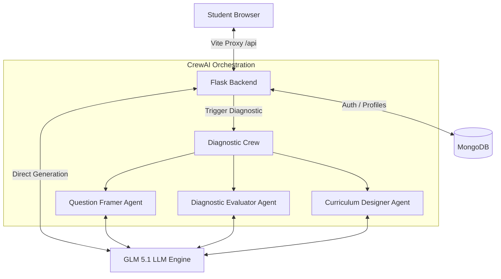

# ElasticLearn AI ⚡

[](https://opensource.org/licenses/MIT)
[](https://www.python.org/)
[](https://react.dev/)
[](https://www.mongodb.com/)
[](https://www.crewai.com/)

An advanced, agentic AI-powered learning platform that dynamically tailors educational content to a student's exact knowledge level. Using multi-agent orchestration and real-time diagnostic evaluation, ElasticLearn AI shifts between **Foundation** and **Acceleration** modes to provide the optimal cognitive load for every learner.

---

## 📖 Table of Contents
- [Core Features](#-core-features)
- [System Architecture](#-system-architecture)
- [Tech Stack](#-tech-stack)
- [Getting Started](#-getting-started)
  - [Prerequisites](#prerequisites)
  - [Backend Setup](#backend-setup)
  - [Frontend Setup](#frontend-setup)
- [How It Works](#-how-it-works)
  - [1. Dynamic Diagnostics](#1-dynamic-diagnostics)
  - [2. Multi-Agent Curriculum Design](#2-multi-agent-curriculum-design)
  - [3. Adaptive Learning & Tutoring](#3-adaptive-learning--tutoring)
- [API Endpoints](#-api-endpoints)
- [License](#-license)

---

## ✨ Core Features

*   **Dynamic Diagnostic Assessment**: Tailored hybrid quizzes (Multiple Choice + Open-ended questions) framed by an AI agent based on user-selected interests.
*   **Dual Cognitive Modes**:
    *   **Foundation Mode**: Explains complex concepts using intuitive analogies (e.g., water flow for electricity), step-by-step breakdowns, and encouraging tones.
    *   **Acceleration Mode**: Geared toward advanced learners. Focuses on mathematical rigor, real-world engineering trade-offs, research papers, and LaTeX equations.
*   **Multi-Agent Orchestration**: Powered by **CrewAI**, leveraging specialized agents (`QuestionFramer`, `DiagnosticEvaluator`, and `CurriculumDesigner`) collaborating sequentially to map out a personalized learning path.
*   **Interactive Help Drawer ("Help Me Understand")**: At any point during a lesson, students can slide open a helper panel to get a topic simplified instantly using cognitive-specific frameworks.
*   **LaTeX Math Rendering**: Native, beautiful equation rendering via **KaTeX** for complex mathematical notations in Acceleration Mode.
*   **Session-based Progress Tracking**: Fully persistent histories, user profile updates, and secure JWT authentication (with Google OAuth support).

---

## 🏗️ System Architecture & Workflow

### Technical Architecture


### Operational User Workflow

```text
                      +-----------------------------+
                      |       React Frontend        | <---- Port 3000 (Vite)
                      |  (Custom Dark/Gold Theme)   |
                      +--------------+--------------+
                                     |
                                 HTTP / JSON
                                     |
                      +--------------v--------------+
                      |        Flask Backend        | <---- Port 5000 (run.py)
                      |       (API Middleware)      |
                      +--------+-------------+------+
                               |             |
                         Local Queries    Async Thread
                               |             |
                      +--------v--------+    +-------v---------------------+
                      |  MongoDB State  |    |     CrewAI Orchestrator     |
                      |  (Port 27017)   |    |         (crews.py)          |
                      +-----------------+    +-------+---------------------+
                                                     |
                                            Sequential Process
                                                     |
                                             +-------v---------------------+
                                             |      AI Agent Layer         |
                                             | - QuestionFramerAgent       |
                                             | - DiagnosticEvaluatorAgent  |
                                             | - CurriculumDesignerAgent   |
                                             +-------+---------------------+
                                                     |
                                                REST API Call
                                                     |
                                             +-------v---------------------+
                                             |     GLM 5.1 LLM Engine      |
                                             |   (Z-AI or NVIDIA Portal)   |
                                             +-----------------------------+
```

---

## 🛠️ Tech Stack

### Frontend
*   **Framework**: React 18 (Vite)
*   **Styling**: Premium Custom CSS (Glassmorphism, Dark & Gold minimalist aesthetic)
*   **Math Rendering**: KaTeX
*   **Auth Integration**: `@react-oauth/google`

### Backend
*   **Framework**: Flask (Python)
*   **Database**: MongoDB (via PyMongo)
*   **Authentication**: Flask-JWT-Extended
*   **AI Agentic Framework**: CrewAI
*   **Language Model**: GLM 5.1 (via Z-AI / NVIDIA API portals)

---

## 🚀 Getting Started

### Prerequisites
*   [Node.js](https://nodejs.org/) (v18+)
*   [Python](https://www.python.org/) (v3.10+)
*   [MongoDB Community Server](https://www.mongodb.com/try/download/community) running locally on port `27017` (or a MongoDB Atlas connection string).

---

### Backend Setup

1. Navigate to the backend directory:
   ```bash
   cd backend
   ```

2. Create a virtual environment and activate it:
   ```bash
   # Windows
   python -m venv venv
   .\venv\Scripts\activate

   # macOS/Linux
   python3 -m venv venv
   source venv/bin/activate
   ```

3. Install dependencies:
   ```bash
   pip install -r requirements.txt
   ```

4. Create a `.env` file in the `backend/` directory:
   ```env
   FLASK_APP=run.py
   FLASK_ENV=development
   SECRET_KEY=your-32-byte-secret-key
   JWT_SECRET_KEY=your-jwt-secret-key
   MONGO_URI=mongodb://localhost:27017/Elastic_LearnAi
   
   # LLM API Keys (At least one is required)
   ZAI_API_KEY=your-zai-api-key
   NVIDIA_API_KEY=your-nvidia-api-key
   ```

5. Run the server:
   ```bash
   python run.py
   ```
   *The backend will start on `http://localhost:5000`.*

---

### Frontend Setup

1. Navigate to the frontend directory:
   ```bash
   cd ../frontend
   ```

2. Install dependencies:
   ```bash
   npm install
   npm install katex
   ```

3. Configure your local environment variables by creating a `.env` in the `frontend/` directory:
   ```env
   VITE_GOOGLE_CLIENT_ID=your-google-client-id.apps.googleusercontent.com
   ```

4. Run the development server:
   ```bash
   npm run dev
   ```
   *The application will be accessible at `http://localhost:3000`.*

---

## 🧠 How It Works

### 1. Dynamic Diagnostics
When a user selects their subjects of interest, the `QuestionFramerAgent` generates a custom mix of MCQs and open-ended questions targeting those exact topics.

### 2. Multi-Agent Curriculum Design
Upon submitting the quiz, a background worker is kicked off:
1.  **Diagnostic Evaluator**: Analyzes the user's answers, identifies specific gaps, and categorizes their understanding.
2.  **Curriculum Designer**: Builds a structured learning path with at least 3 distinct modules, assigning either **Foundation** or **Acceleration** mode to each based on evaluated capability.

### 3. Adaptive Learning & Tutoring
During active tutoring, the system prompt morphs:
*   In **Foundation Mode**, concepts are presented with simple analogies and step-by-step guides.
*   In **Acceleration Mode**, mathematical derivations and equations are displayed utilizing LaTeX:
    $$\nabla^2 \Phi = 4\pi G \rho$$

---

## 🔌 API Endpoints

### Authentication
*   `POST /api/auth/register` - Register a new user account.
*   `POST /api/auth/login` - Authenticate and receive a JWT.
*   `POST /api/auth/google` - Exchange a Google OAuth profile for a JWT.

### Diagnostics & Jobs
*   `POST /api/diagnostic/questions` - Retrieve personalized diagnostic questions.
*   `POST /api/diagnostic/submit` - Submit diagnostic answers (starts background evaluation).
*   `GET /api/jobs/<job_id>` - Poll status of the background evaluation job.

### Learning & Tutoring
*   `POST /api/learning/query` - Interact with the tutor in the current mode.
*   `POST /api/learning/help` - Trigger the "Help Me Understand" drawer for a specific topic.

---

## 📄 License

Distributed under the MIT License. See `LICENSE` for more information.
